# 타임스페이스 작업 내역 문서
 - 다음 버전v1.6 에서 할일
    - 코드미러 v5.2.1 MIT라이센스
    - 기존 파일관리자에 사용되는 코드미러에디터 기능개선예정.
    - 게시판 종류 2가지(qa, community) fullpage플러그인에 추가예정.
    - 메뉴와 연동되는 Ckeditor 콘텐츠 미리보기기능을 realtime.html처럼 변경고려중.
    - 또는, 기존 작동방식은 놔두고, 실제 사용자 페이지를 realtime.html처럼 변경고려중.
    - 플러그인 종류 변수처리.

<h2 class="text-center"> 타임스페이스 v1.5 사용법 </h2>
 - 결과확인URL: <a href="http://time-space.biz/_fullpage/" target="_new">타임스페이스v1.5 미리보기</a>
<hr />
<p> 설치 및 실행 요약을 보여드리겠습니다. </p>
<ol>
<li> 인스톨 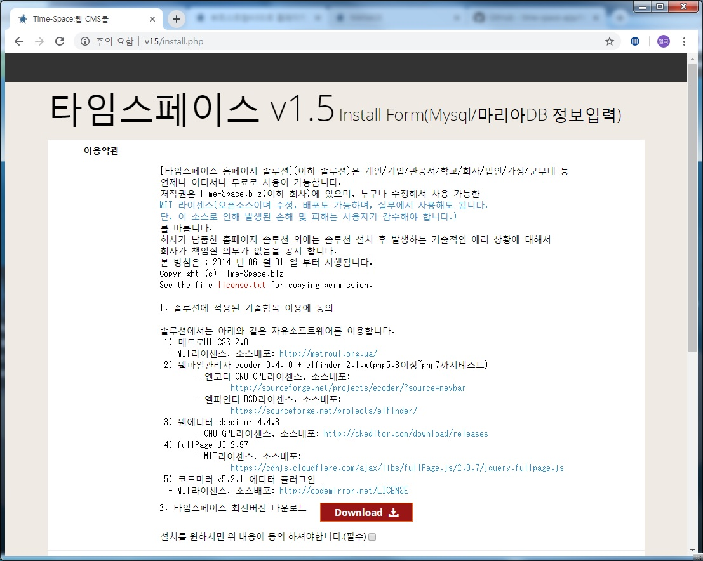</li>
<li> 인스톨OK 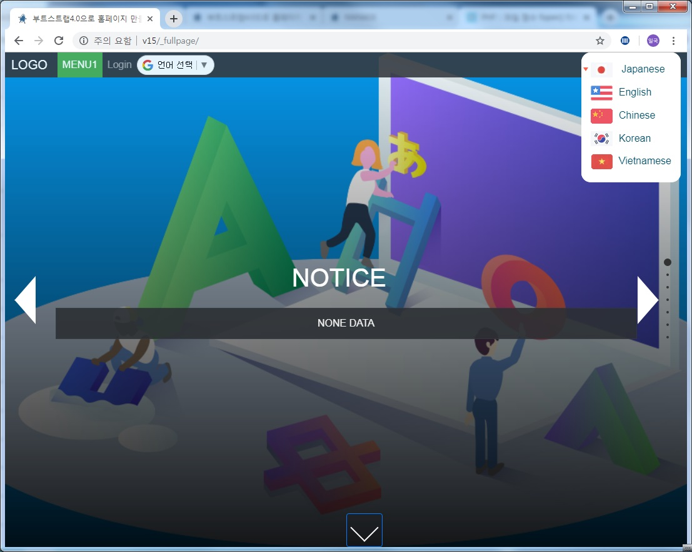</li>
<li> 로그인 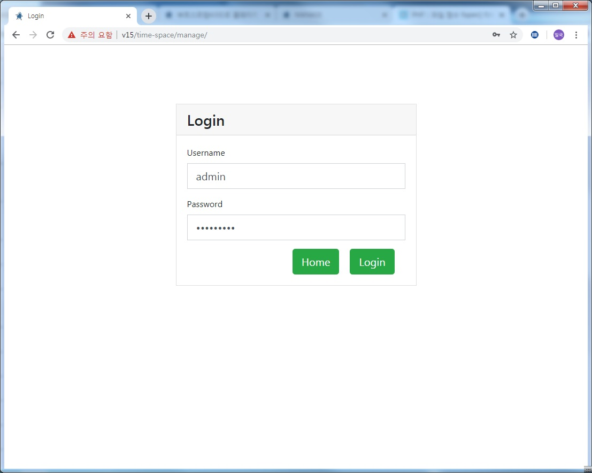</li>
<li> 로그인OK-초기화면 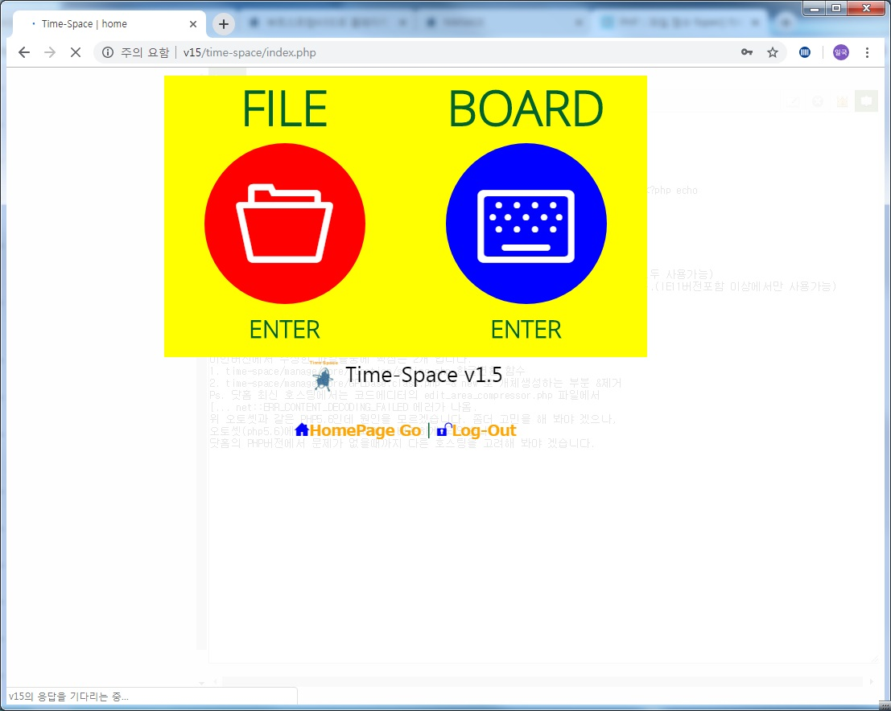</li>
<li> 파일매니저에서 플러그인 폴더구조확인 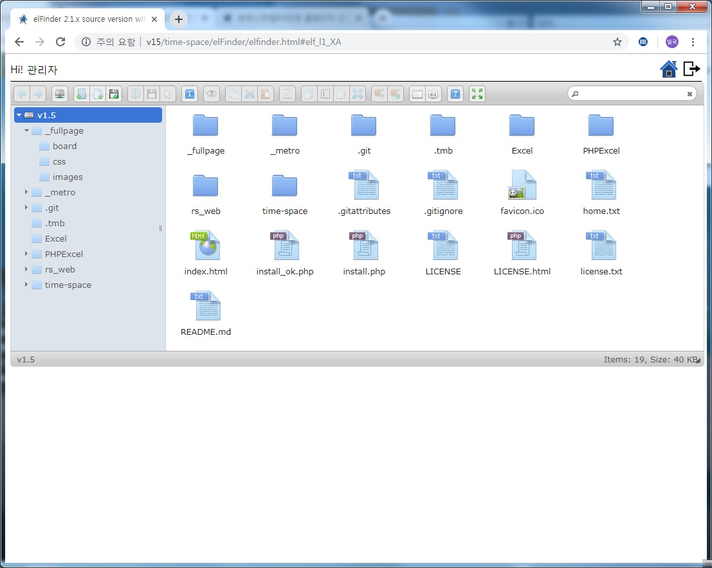</li>
<li> 보드매니저에서 CMS확인 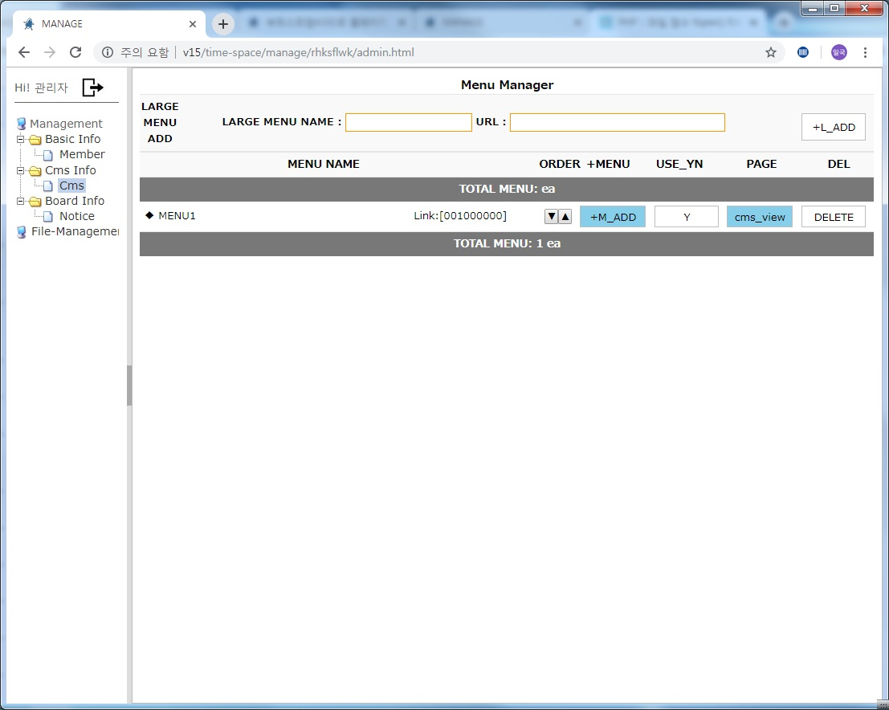</li>
<li> CMS 메뉴추가 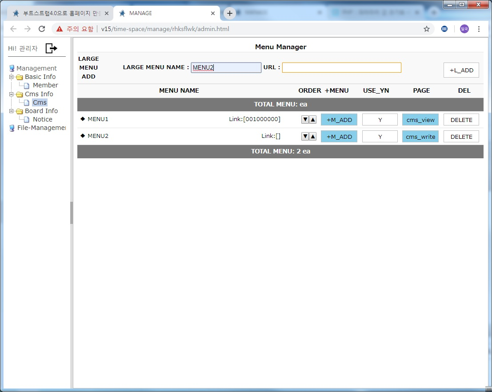</li>
<li> CMS 콘텐츠추가 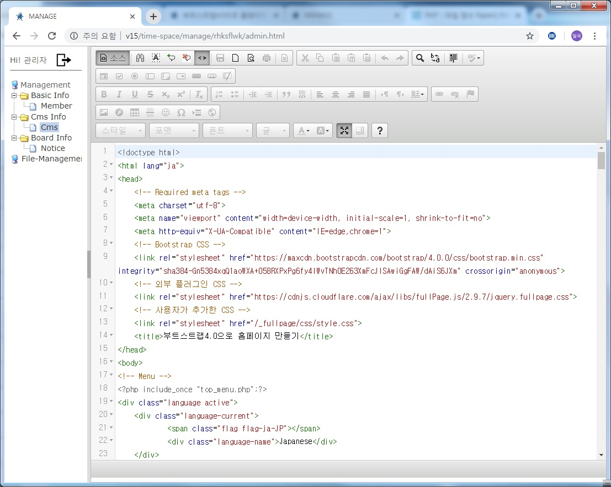</li>
<li> 게시판 내용추가 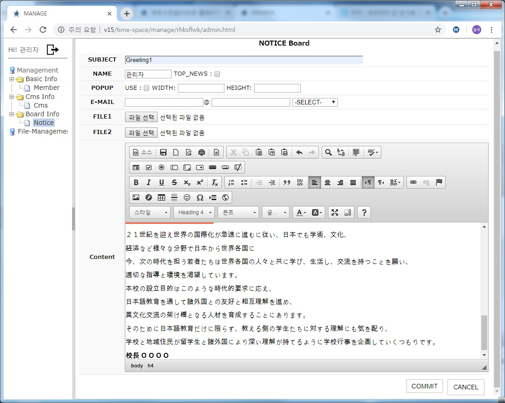</li>
<li> 회원관리 </li>
<li> 메뉴 및 콘텐츠추가 결과 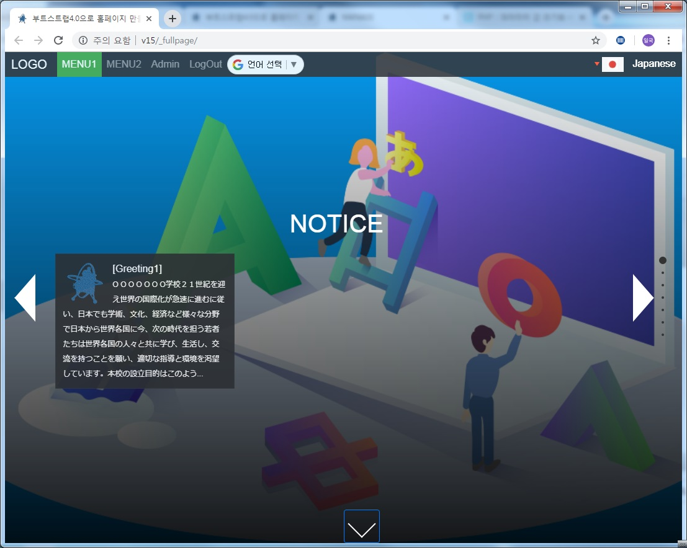</li>
</ol>
<p> 작업내역 요약 </p> 
<blockquote> 
<p>v1.5에 적용된 fullPage플러그인은 작업시 10개의 공정으로 구성됩니다. </p>
</blockquote>
<ol>
<li> _fullpage.html 디자인 퍼블리싱 <a href="http://time-space.biz/_fullpage/_fullpage.html" target="_new">미리보기</a> </li>
<li> _fullpage.php 코딩입히기 <a href="http://time-space.biz/_fullpage/_fullpage.php" target="_new">미리보기</a> </li>
<li> top_menu.php 동적메뉴 php코딩 </li>
<li> header.php 전체공통 상단 php코딩 </li>
<li> footer.php 전체공통 하단 php코딩-현재 내용없음. </li>
<li> index.php 콘텐츠 불러오기 php코딩 - 모든 메뉴와 연동된 콘텐츠내용이 이곳에서 출력 됩니다.</li>
<li> list.php 사용자단 게시판 목록 전용 php코딩 </li>
<li> view.php 사용자단 게시판 뷰 전용 php코딩 </li>
<li> board_header.php 게시판공통 상단 php코딩 </li>
<li> board_footer.php 게시판공통 하단 html태그 </li>
</ol>

<p>위 작업 플로우를  <mark>vs code</mark> 작업에디터에서 본 화면은 아래와 같습니다.</p>
<p>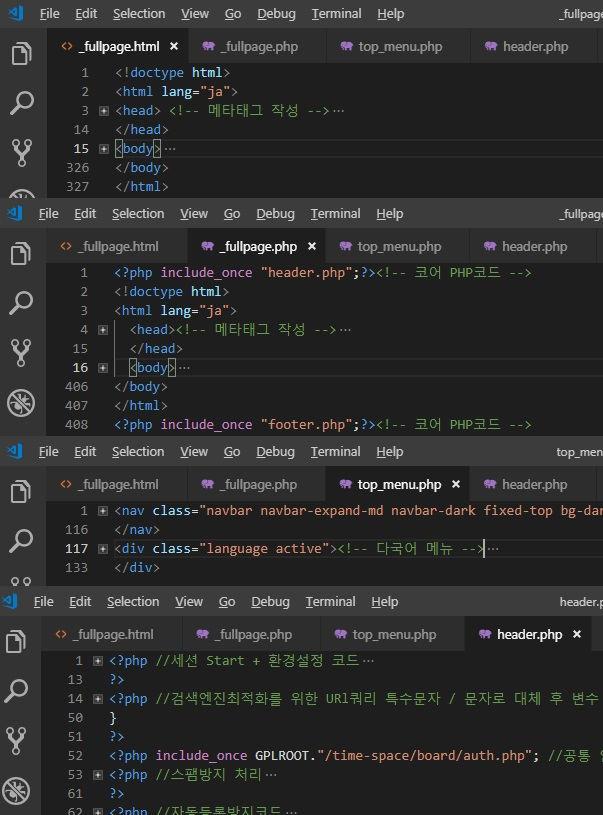</p>
<p>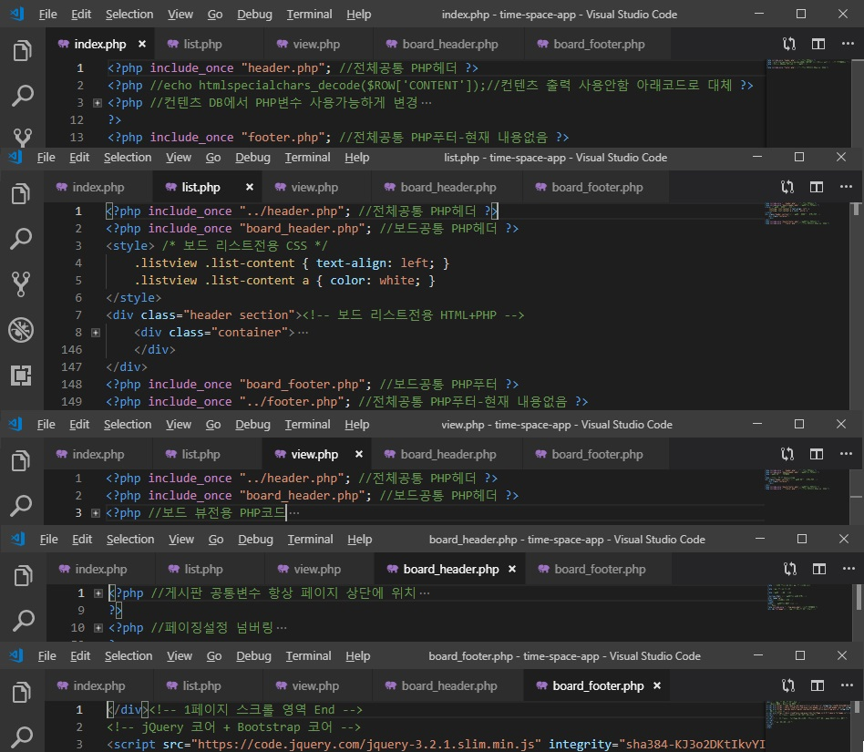</p>
<hr />

 - 2019.07.17 타임스페이스 v1.5 마무리.
    - 초기 DB에 기본 Home 메뉴 생성 쿼리 추가 (설치시 관리자 admin / admin1234 추가하는 방식과 같음).
    - 프레임웍 게시판 노출처리.
    - fullPage UI 플러그인 커스터 마이징
 - 2019.07.14 기술문서 Git샤이트 메일폼 추가.
    - 구글 앱 스크립트사용
 - 2019.07.13 기술문서 Git샤이트 도메인연결.
    - http://time-space-app.github.io => http://app.time-space.biz
    - Git사이트에 jekyll기반 rb루비 검색기능 추가
 - 2019.07.10 로그인 처리-코어수정.
 - 2019.07.09 기술문서 Git사이트 생성.
    - 로컬PC에 루비rubyinstaller-devkit-2.5.5-1-x64 설치(https://rubyinstaller.org/) 후 블로그 생성
 - 2019.07.08 로그인 처리-코어수정.
    - 프레임웍 변수 v1.4 -> v1.5 버전정보 값 변경(/time-space/version.php).
 - 2019.07.07 3단까지 서브메뉴 추가 작동 처리-코어수정.
 - 2019.07.06 기본metro플러그인 폴더를 _metro로 변경.
    - 신규 fullpage플러그인을 _fullpage폴더로 추가.
 - 2019.07.05 저장소 개발환경 생성.
    - Github DeskTOP 설치 후 VS code 개발툴 환경구성.
 - 2019.07.04 로컬 개발환경 생성.
    - 타임스페이스 프레임웍 개발환경 설치: wampserver3.1.9_x64.
    - wmap패널 localhost 항목에서 vhost를 사용해서, 여러 프로젝트 작업 가능처리.
    - 타임스페이스 v1.4 개발코드 실행.
<pre>
*wampserver3.1.9_x64 설치시:
주의) vs12_vcredist_x64 -> vs13_vcredist_x64 -> vs15_vcredist_x64 모두 설치해야 한다.

*wampserver3.1.9_x64 설정: 패널아이콘(마우스를 이용)해서...아래 2가지 설정 후 wamp재실행.
1.아파치설정- html내에서 php코드 실행가능하게
httpd.conf 항목추가
AddType application/x-httpd-php .php4 .php .phtml .ph .inc .html .htm
2.mysql설정- 
[client]
default-character-set=utf8
[mysqldump]
default-character-set = utf8
[mysql]
default-character-set=utf8
[mysqld]
init_connect="SET collation_connection = utf8_general_ci"
init_connect="SET NAMES utf8"
character-set-server = utf8
</pre>

새 기술문서 작성 방법(지킬플러그인사용) 예: 파일명= _posts/2019-06-29-plugin-fullpage.md
아래는 입력내용 예시
<pre>
---
title: "부트스트랩4.0기반 fullPage플러그인 사용"
layout: post
author: TimeSpace
summary: 타임스페이스에 사용될 fullpage플러그인
thumbnail: posts/hello.jpg
categories: fullPage
---

이 게시물은 _posts 디렉토리에서 찾을 수 있습니다. 계속해서 수정하고 사이트를 다시 빌드하여 변경 사항을 확인하십시오. 
여러 가지 방법으로 사이트를 재구성 할 수 있지만 가장 일반적인 방법은 웹 서버를 시작하고 
파일이 업데이트 될 때 사이트를 자동으로 재생성하는 jekyll serve를 실행하는 것입니다.

새 게시물을 추가하려면,
YYYY-MM-DD-name-of-post.ext 규약을 따르는 _posts 디렉토리에 파일을 추가하고 필요한 앞부분을 포함하십시오. 
이 게시물의 출처를보고 어떻게 작동하는지에 대한 아이디어를 얻으십시오.

Jekyll은 코드 스 니펫에 대한 강력한 지원도 제공합니다.
</pre>
```python
def print_hi(name):
  print("hello", name)
print_hi('Tom')
```
    
